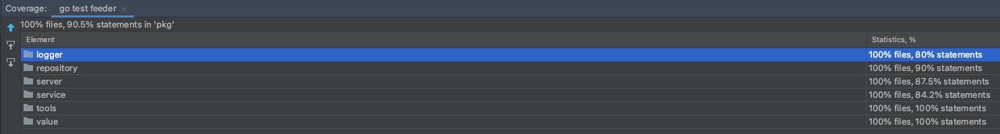
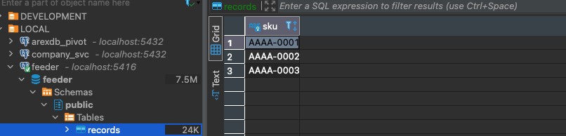

# Feeder Service (product SKU)

Using go programming language, write a feeder-server ("Application") that opens a socket and restricts input to at most 5 concurrent clients (providers). Clients will connect to the Application and write any string (product sku) of 9 characters in a specific format, and then close the connection.
The Application must write a de-duplicated list of these numbers to a log file in no particular order.

1. The Application must accept input from at most 5 concurrent clients on TCP/IP port 4000.
2. Input lines presented to the Application via its socket must either be composed of exactly nine
   characters in correct format (first 4 characters must be letters, a dash and next 4 characters must be numbers (e.g.: KASL-3423 or LPOS-32411) immediately followed by a server-native newline sequence; or a termination sequence as detailed below.
3. The application must be running for a 60 seconds, then application stops and report will be displayed in standard output as detailed below.
4. Each product sku must be followed by a server-native newline sequence.
5. Any data that does not conform to a valid line of input should be discarded.
6. When applications finish (after 60 seconds delay), it must print a report to standard output:
   ◦ totalnumberofuniqueproductskusreceivedforthisrunoftheApplication
   ◦ totalnumberofduplicatedproductsskusreceivedforthisrunoftheApplication ◦ totalnumberofinvalidSkuformatreceivedforthisrunoftheApplication
   ◦ Exampletext:Received50uniqueproductskus,2duplicates,4discardvalues
7. If any connected client writes a single line with only the word "terminate" followed by a server- native newline sequence, the Application must disconnect all clients and perform a clean shutdown as quickly as possible (before 60 seconds after it started)
8. Clearly state all of the assumptions you made in completing the Application.

## Folders

- cmd
    - feedersrv: main function where we run the server
  
- pkg
    - logger: custom logger to write unique skus in file when server shutdown.
    - repository: include interface sku repository and implementation in postgres. 
    - server: include the server to control concurrency connections and handle requests.
    - service: include feeder service. It is  safe to be used in concurrency system. 
    - tools: small functions like helpers to simplify code and unit testing.
    - value: value objects. We include sku value object to validate sku values.
    
## Thechnical side

We have used ports and adapters architecture, that allow us can change infrastructure of repository or logs really easy
and make unit test in a easy way as well.

We could have put other structure folder like domain, infrastructure, application ... but in this case we keep simple because
is a really small service so we don´t want increase the complexity of structure folders or more layers in this case.

We have used testify like dependencies only because assertions are more semantic and is quit standar in the community 
but mocks struct were created manually, by the way we can delete that dependency in a easy way with small changes in tests.

## Timeout and signal system

We solve with context propagation, `signal.NotifyContext` and `context.WithTimeout` to close the application following the 
requirements.

## Concurrency

We solve the concurrency and terminate the application by client with channels:

- channel with buffer: to control 5 concurrent clients
- channel without buffer: to control when a client send message "terminate" to close the application.

## Performance

We store all sku sent by clients and reports in memory (we control safe concurrency with mutex). Only when the application
is down by:

- system signal
- timeout
- by client ("terminate" message)

It is when all data save in memory, we save a log file with uniques sku for that running, print in stdout report and 
persist unique sku in postgres (if already exists in the database from previous executions we ignore but print 
in stadout skipped sku).

## Coverage



## Run the application

- `make run`: (this up posgres in docker and execute go run)

Optional:

As well you can run the application in container if you don`t have go installed in your machine:

- `docker-compose up`: you will see container for the service and another one for postgres database 

Note: After 60 seconds whe application shutdown, so you can execute again `make run` or increment `server.Config` the 
parameter `KeepAlive`. As well you can modify `MaxConn` by default is 5.

## Execute tests

Ensure db container is up because we have an integration test for repository implemented with postgres.

- `make test`

## Demo

Five clients connect to server. A sixth client try to connect but is communicated him `limit connections reached` and
close that connection. We log all happen during the execution.
In this case one client send `terminate` message and close the server. It will have the same behaviour before
close the server (print reports, create log file and persists in postgres) if we receive signa from system (you can try ctrl+c)
or expire time (keepAlive parameter).


Log file generated in demo `feeder_2021-10-03T17:12:09.608155+02:00.log`:

```
INFO: 2021/10/03 17:14:04 Added sku:AAAA-1
INFO: 2021/10/03 17:14:04 Added sku:AAAA-2
INFO: 2021/10/03 17:14:04 Added sku:AAAA-3
```

Rows inserted in database:



You can test in your local and send from the client with:

- `telnet localhost 4000`
